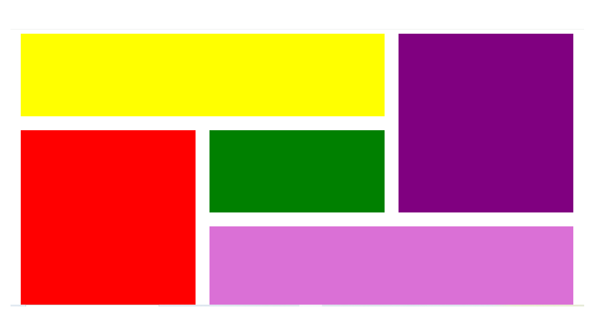

# Grid Layout Project

Un exercice pratique démontrant l'utilisation avancée de CSS Grid Layout.

## Résultat visuel

## Points clés

- Mise en place d'une grille responsive avec `display: grid`
- Utilisation de `grid-template-areas` pour une disposition visuelle intuitive
- Gestion des espaces avec `gap` et `padding`
- Création d'une mise en page complexe avec des éléments de différentes tailles

## Compétences techniques démontrées

- CSS Grid Layout
- Organisation du code CSS
- Gestion de l'espacement et des marges
- Création de layouts complexes et responsifs

## Structure

Le projet utilise une grille 3x3 pour créer une mise en page avec 5 éléments de différentes couleurs, démontrant la flexibilité de CSS Grid pour créer des designs complexes.
